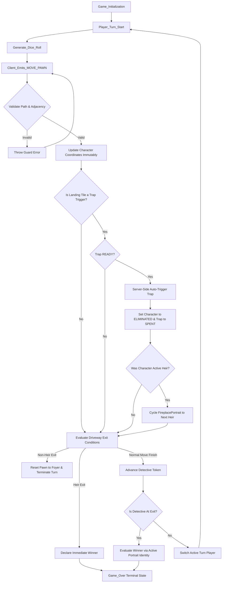

# System Design Document (SDD): 13 Dead End Drive
# ─────────────────────────────────────────────────────────────────────────────
# Revision history:
#   v1.0  Phase 1.3 — Initial skeleton
#   v1.1  Phase 1.4 — Reconciled server-side trap triggers to position-only
#   v1.2  Phase 2.2 — Added turn-advance and detective track integration
#   v1.3  2026-05-27 — GRID_21X15, trap pending flow, 10-step detective, React HUD overlays
# ─────────────────────────────────────────────────────────────────────────────

---

## 1. Architectural Architecture & Core Design Principles

To ensure complete system resilience, deterministic board game simulations are completely decoupled from real-time spatial physics loops and visual client view tracking layers.

- **Core State Engine (`/src/engine`)**: A pure, deterministic functional state environment driven by events `(currentState, event) => nextState`. Every transition is synchronous, atomic, side-effect-free, and perfectly reproducible from an event log.
- **Client Render & Animation Loop (Visual/Kinematics Layer)**: Decoupled from the state engine. While the core engine performs instant, atomic transitions (e.g., character coordinates update immediately, status switches to `ELIMINATED` on a trap, trap switches to `SPENT`), the client layer receives these updates and is responsible for calculating visual kinematics (such as falling chandelier acceleration, stairs sliding vectors, character movement easing curves) to run smooth animations in the client UI without contaminating the core game state variables.

---

## 2. Real-Time Game Loop State Machine

The following Mermaid diagram maps out the precise evaluation cycle for every session turn. Ensure your code parsing and execution pipelines align with this logic path:



---

## 3. Core Module Registry & Responsibilities

The codebase enforces strict, single-responsibility boundaries. Cross-module calls are routed via the orchestrator to prevent circular dependency chains.

| Module | Purpose / Scope | Primary Exports |
|--------|-----------------|-----------------|
| `moveCharacter.ts` | Path validation + pawn position update | `moveCharacter()` |
| `trapEvaluator.ts` | Post-condition trap trigger evaluations, portrait changes, player elimination | `evaluateTraps()` |
| `detectiveTrack.ts` | Detective track step advance + mass elimination | `advanceDetective()` |
| `playCard.ts` | Validate and resolve card plays (discriminated union card actions) | `playCard()` |
| `winCondition.ts` | Win/loss condition checking | `evaluateWinCondition()` |
| `turnOrchestrator.ts` | High-level event parsing and cross-module execution flow | `processTurn()` |

---

## 4. State Immutability & Structural Cloning Contract

The game state is treated as an immutable database. No engine module may mutate the incoming state object directly. All modifications are made using structural spread operators to return a fresh `GameState` instance.

```typescript
// Canonical update example:
const nextState: GameState = {
  ...state,
  characters: {
    ...state.characters,
    [characterId]: {
      ...character,
      position: newCellId,
    },
  },
  updatedAt: timestamp,
};
```

This guarantees:
1. **Time-travel debugging**: Easily store past turns and roll back states.
2. **Crash safety**: Failed validation doesn't leave the game in a partially modified, corrupted state.
3. **Optimized networking**: Allows comparing old/new state models to generate minimal delta patches (`GameStatePatch`).
